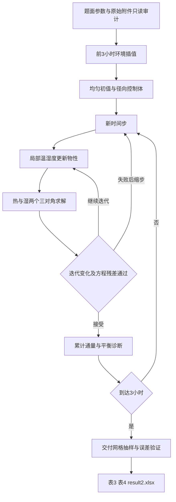

# A 题问题 2：解题框架与公式推导

本文完成题面解读、第一问复用分析、输入审计和第二问数学及数值框架。尚未运行第二问的偏微分方程求解，不包含表 3、表 4 的预测数值，也不代表 `result2.xlsx` 已生成。

## 1. 题意与本问边界

依据 `problem.pdf` 第 2 页问题 2、第 3 页附件说明及第 4 页附录 3，并按用户明确的任务范围，本问在固定圆柱几何上建立前 3 h 的温度和干基含水率模型。“烘干过程一般持续 2 至 3 天”仅作题目背景，不扩展本问计算时域。

| 项目 | 本问采用的解释 | 依据及影响 |
|---|---|---|
| 几何与初值 | 长 25 cm、半径 2 cm，初始 28°C、2.55 kg/kg | 继承问题 1 的同一药材 |
| 物性 | 从烘干初始时刻统一采用附录 3 | 题面明确要求经验公式统一采用附录 3 |
| 环境输入 | 附件 1 的烘房温度和水分浓度 | 前 3 h 已有完整观测覆盖 |
| 论文表格 | 0.5、1、1.5、2、2.5、3 h；0、0.5、1、1.5、2 cm | 表 3、表 4 各为 6 行、5 个空间点 |
| 完整输出 | 1 至 10800 s，每秒一次；0 至 2 cm，每 0.1 cm 一点 | 沿用模板从第 1 s 开始的约定 |
| 半径变化 | 第二问仍固定半径 | 问题 4 才引入附件 2 和收缩模型 |
| 干燥终点 | 留给第三问计算 | 第二问无需把 0.15 kg/kg 当作前 3 h 的停止条件 |

**必须澄清的衔接：** 第一问提供方程结构和数值方法，不提供第二问的续算初值。第二问从原始均匀初值重新计算前 1800 s；不能先用附录 2 计算 30 min，再切换到附录 3。1800 s 是第一问的输出上限，题面没有把它指定为工艺参数的突变时刻。

本问是给定参数、边界和初值的正问题，不是优化或参数辨识问题。暂不构造加权评分、拟合目标函数或未经题目要求的最优温湿度控制。

## 2. 第一问的求解基础与当前材料问题

### 2.1 可以继承的结构

第一问的模型是圆柱一维径向非稳态导热与非线性水分扩散。轴线采用对称条件，表面采用 Robin 条件，烘房观测采用分段线性插值。代码中可辨认的算法为节点中心有限体积、后向 Euler、水分 Picard 迭代及三对角求解。

| 第一问内容 | 第二问处理 |
|---|---|
| 圆柱半控制体及界面面积 | 保留，避免直接计算轴线处的除以半径 |
| 固定半径与输出网格 | 保留，区分计算网格和 0.1 cm 交付网格 |
| 环境插值 | 保留，读取覆盖区间从 1800 s 扩展至 10800 s |
| 常数密度、比热、导热系数 | 替换为每个节点的局部含水率函数 |
| 仅含水率相关的扩散系数 | 替换为局部温度与含水率的二元函数 |
| 热方程单次线性求解，水分单独迭代 | 改为两场在每个时间步共同迭代 |
| 固定热矩阵 | 不能复用；热容和导热系数改变时重新组装 |
| 严格随时间单调的检查 | 改为范围、通量、残差检查，单调性只作诊断 |
| 第一问常系数热量检查 | 改为与变系数离散储热项一致的平衡检查 |

### 2.2 当前文件的实际状态

以下是本次读取工作区得到的证据，不把旧审查结论当作当前复算结果：

1. `src/problem-1/solve_problem1.py` 含 18 组冲突起始标记，首次位于第 31 行。静态语法分析失败，当前文件不能导入或执行。其中同时出现计算网格 800 与 1600 两种分支。
2. 第一问公式文档及两份表格 CSV 也含冲突标记，不能直接作为唯一版本的计算依据。
3. `output/problem-1/result1.xlsx` 可读取，两个工作表均为 1802 行、22 列，时间为 0 至 1800 s，A1 为“时间/s”，数值格式为 `General`。它与模板从第 1 s 开始及四位小数显示要求不一致。
4. `问题1_算法与模型说明.md` 声称采用 1600 网格和修正后的输出格式，但当前工作簿格式并未与之同步。`verification.txt` 的历史残差也不能证明当前含冲突标记的代码已通过检查。
5. 当前工作簿在 1800 s 的中心和表面温度分别为 33.5754°C、36.7856°C，含水率分别为 2.5500、1.5102 kg/kg。这些只是读取到的第一问结果，可作历史对照，不能作为第二问初值或本次复算结论。

本次未修改第一问文件。后续如果选择直接复用其代码，需要先整理冲突并复核；也可在第二问目录实现已核对的离散结构，避免导入当前无法执行的文件。

### 2.3 不能继续沿用的物理表述

- 两端面积占比约 7.41% 是几何比例，不能解释为一维模型误差为 7.41%。长时间计算的端部影响需单独评估。
- “潜热缺口固定为 33.6 倍”依赖密度基准和传质势的额外解释，不能作为确定结论。第二问也不能据此加入任意潜热修正系数。
- 第一问的“已收敛”不能替代第二问的收敛研究，因为物性、耦合强度和计算时长均已变化。

## 3. 数据审计与处理边界

审计脚本为 `src/problem-2/audit_problem2_inputs.py`，证据写入 `output/problem-2/input_audit.json`。原始数据只读，未删行、填补、平滑、裁剪异常或覆盖文件。

| 输入 | 本次核查结果 | 使用方式 |
|---|---|---|
| `problem.pdf` | 与原始 A 题 PDF 的 SHA-256 相同 | 核对要求及经验公式，附录 3 已渲染检查分数线与指数 |
| `data/附件1.xlsx` | 与原始附件哈希相同；Sheet1 为 242 行、3 列，含 241 个观测 | 读取时间、烘房温度、烘房水分浓度 |
| 附件 1 全区间 | 0 至 14400 s，间隔全为 60 s | 没有缺失、非数值、重复或逆序时间 |
| 附件 1 前 3 h | Excel 第 2 至 182 行，共 181 个观测 | 按时间范围选取，是任务范围截取，不是异常剔除 |
| 温度范围 | 前 3 h 和全文件均为 28 至 50.246°C | 不把 50°C 设置成硬上限 |
| 烘房水分浓度范围 | 前 3 h 和全文件均为 0.01963 至 0.05025 kg/kg | 作为经验边界输入 |
| `data/附件3/result2.xlsx` | 与原始模板哈希相同；两个工作表均为 5 行、6 列的示意模板 | 空白结果单元格与省略号是模板占位，不是缺失观测 |
| 第一问工作簿 | 可读取，所有数字有限 | 仅核查格式和历史代表值 |

原始观测中后期温湿度出现小幅回落；没有证据说明这些波动是错误，本次全部保留。全区间有 95 个温度下降区间、80 个烘房水分浓度下降区间。因此本问不能照搬第一问的全时域严格单调验收条件。

有意义的数据处理仅包括：读取原始行；按本问时间范围选择；对环境数据分段线性插值；内部长度由 cm 换为 m；扩散公式的温度由 °C 换为 K；计算结束后按要求抽样及显示四位小数。以上均在派生数组或新输出中完成，迭代过程中不舍入。

当前未发现需要处理的原始数值异常，无异常处理审批事项。已发现的是第一问代码和交付文件一致性问题，不能通过删除附件观测来处理。

## 4. 符号、假设与物性

### 4.1 变量与建模假设

| 符号 | 定义 | 单位或角色 |
|---|---|---|
| r、t | 径向坐标、时间 | m、s |
| R、L | 药材半径、长度 | 0.02 m、0.25 m |
| T(r,t)、C(r,t) | 药材温度、干基含水率 | °C、kg 水/kg 绝干物质；待求状态 |
| Θ(r,t) | 药材绝对温度 | K；仅用于需要绝对温度的物性公式 |
| T∞(t)、C∞(t) | 烘房温度、烘房水分浓度 | °C、kg/kg；外部输入 |
| ρ、cₚ、k、D | 密度、比热容、导热系数、有效水分扩散系数 | 由附录 3 计算 |
| a | 体积显热容量 | J/(m³·K) |
| h、hₘ | 表面对流换热、传质系数 | W/(m²·K)、m/s |

基本假设：药材均质、各向同性、环境周向均匀；主模型求轴向中部的一维径向场，忽略端面；第二问半径固定；温湿场通过局部物性相互影响；采用显热和有效扩散的经验闭合，不加入题面未给定的相变热、湿分携带焓或吸附平衡项。

附录 3 未重新给出表面对流系数。主模型沿用附录 2 的数值，明确作为继承假设，而非声称附录 3 也列出了它们：

$$
h=25\ \mathrm{W/(m^2\cdot K)},\qquad h_m=8\times10^{-7}\ \mathrm{m/s}.\tag{1}
$$

### 4.2 附录 3 的正确实现

温度输出使用摄氏度，代入扩散公式前转换为开尔文：

$$
\Theta=T+273.15.\tag{2}
$$

附录 3 的三个含水率相关热物性分别为：

$$
\rho(C)=650+128C\quad[\mathrm{kg/m^3}].\tag{3}
$$

$$
c_p(C)=1450+2736\frac{C}{C+1}\quad[\mathrm{J/(kg\cdot K)}].\tag{4}
$$

$$
k(C)=0.21+0.38\frac{C}{C+1}\quad[\mathrm{W/(m\cdot K)}].\tag{5}
$$

将公式（2）代入附录 3 的温度项，得到：

$$
D(T,C)=2.4\times10^{-3}
\exp\left(-\frac{0.45}{C}\right)
\exp\left(-\frac{3850}{T+273.15}\right)
\quad[\mathrm{m^2/s}],\qquad C>0.\tag{6}
$$

由公式（3）和公式（4）定义局部体积显热容量：

$$
a(C)=\rho(C)c_p(C).\tag{7}
$$

由公式（5）和公式（7）定义局部热扩散率，仅用于量级分析：

$$
\alpha(C)=\frac{k(C)}{a(C)}.\tag{8}
$$

每个节点使用其自身的温度与含水率计算公式（3）至公式（8）。不能把空间平均含水率代入后用于整个药材，也不能在公式（6）中使用烘房温度代替内部局部温度。

下表是公式（3）至公式（8）在指定状态下的代入值，**不是第二问预测结果**：

| 指定状态 | 密度 kg/m³ | 比热 J/(kg·K) | 导热系数 W/(m·K) | 扩散系数 m²/s |
|---|---:|---:|---:|---:|
| 28°C，2.55 kg/kg | 976.4000 | 3415.2958 | 0.4830 | 5.6417×10⁻⁹ |
| 50°C，2.55 kg/kg | 976.4000 | 3415.2958 | 0.4830 | 1.3471×10⁻⁸ |
| 50°C，0.15 kg/kg | 669.2000 | 1806.8696 | 0.2596 | 8.0012×10⁻¹⁰ |

由公式（1）、公式（5）和公式（6）定义径向尺度下的 Biot 数：

$$
\mathrm{Bi}_T=\frac{hR}{k(C)},\qquad
\mathrm{Bi}_M=\frac{h_mR}{D(T,C)}.\tag{9}
$$

由公式（9）可得，初始两个 Biot 数约为 1.0353、2.8360；在 50°C、0.15 kg/kg 的指定状态下，传质 Biot 数约为 19.9970。这表明内部分布不能简单用全体均匀的集总模型代替；干燥后期局部扩散阻力可能更突出。

## 5. 环境边界与阶段衔接

对附件 1 的相邻观测时刻，令 Y 代表烘房温度或烘房水分浓度，构造：

$$
Y_\infty(t)=Y_j+
\frac{Y_{j+1}-Y_j}{t_{j+1}-t_j}(t-t_j),
\qquad t_j\le t\le t_{j+1}.\tag{10}
$$

由公式（10）可得，插值经过每个观测点，区间内不超出相邻端点范围。只读核验发现，在原始观测时刻的插值误差为零。求解器每个子时间步均查询该函数，不能只在整秒更新边界。

| t/s | T∞/°C | C∞/(kg/kg) |
|---:|---:|---:|
| 0 | 28.000 | 0.01963 |
| 1800 | 41.513 | 0.03307 |
| 3600 | 47.485 | 0.04272 |
| 5400 | 49.116 | 0.04728 |
| 7200 | 49.852 | 0.04894 |
| 9000 | 50.163 | 0.04981 |
| 10800 | 50.195 | 0.04977 |
| 14400 | 50.165 | 0.04986 |

预热与接近恒温的过程由环境曲线和局部物性的连续变化体现。第一问截止时刻的环境温度为 41.513°C，仍明显低于后段约 50°C 的水平，因此不能仅凭“第一问算到 30 min”就设定 30 min 后恒温。

按用户确认，本问终点固定为 10800 s。附件 1 第 2 至 182 行已覆盖全部需要的边界时刻，不外推 4 h 以后的环境，不估计额外的恒温常数，也不把 2 至 3 天设为本问仿真时长。上表的 14400 s 记录只说明附件覆盖情况，不进入前 3 h 的计算。

## 6. 温度方程的逐步推导

取长度为 L、半径从 r 到 r+dr 的薄圆环，忽略二阶小量，其体积为：

$$
\mathrm dV=2\pi rL\,\mathrm dr.\tag{11}
$$

以径向向外为正，由 Fourier 定律和公式（5）写出导热通量：

$$
q_r=-k(C)\frac{\partial T}{\partial r}.\tag{12}
$$

采用局部显热储存闭合，联立公式（7）和公式（11），令显热积累等于内侧流入减外侧流出：

$$
a(C)\frac{\partial T}{\partial t}\,2\pi rL\,\mathrm dr
=2\pi L\{r q_r(r)-(r+\mathrm dr)q_r(r+\mathrm dr)\}.\tag{13}
$$

将公式（13）除以圆环体积，再令厚度趋于零：

$$
a(C)\frac{\partial T}{\partial t}
=-\frac{1}{r}\frac{\partial(rq_r)}{\partial r}.\tag{14}
$$

把公式（12）代入公式（14），得到主模型的热方程：

$$
\boxed{a(C)\frac{\partial T}{\partial t}
=\frac{1}{r}\frac{\partial}{\partial r}
\left[rk(C)\frac{\partial T}{\partial r}\right]}.\tag{15}
$$

为说明变导热系数不能移到散度算子外，先对公式（15）的右端应用乘积求导：

$$
\frac{1}{r}\frac{\partial}{\partial r}(rkT_r)
=kT_{rr}+\frac{k}{r}T_r+k_rT_r.\tag{16}
$$

由公式（5）应用商法则和链式法则：

$$
\frac{\mathrm dk}{\mathrm dC}
=0.38\frac{(C+1)-C}{(C+1)^2}
=\frac{0.38}{(C+1)^2},\qquad
k_r=\frac{0.38}{(C+1)^2}C_r.\tag{17}
$$

联立公式（15）至公式（17），得到等价的展开式：

$$
a(C)T_t=k(C)\left(T_{rr}+\frac{T_r}{r}\right)
+\frac{0.38}{(C+1)^2}C_rT_r.\tag{18}
$$

由公式（18）可得，直接把常系数公式中的热扩散率改成局部变量、却只保留径向 Laplace 项，会漏掉含水率梯度导致的项。计算时应实现公式（15）的通量形式，不需要显式离散公式（18）中的梯度乘积。

## 7. 水分方程的逐步推导

药材干基含水率定义为：

$$
C=\frac{m_w}{m_d}.\tag{19}
$$

为继承第一问的有效扩散模型，采用固定干物质参考密度，对水分质量通量除以该常数，得到有效通量：

$$
j_r=-D(T,C)\frac{\partial C}{\partial r}.\tag{20}
$$

联立公式（11）、公式（19）和公式（20），对参考干物质归一化后的水量作控制体平衡：

$$
\frac{\partial C}{\partial t}\,2\pi rL\,\mathrm dr
=2\pi L\{rj_r(r)-(r+\mathrm dr)j_r(r+\mathrm dr)\}.\tag{21}
$$

将公式（21）除以圆环体积并令厚度趋于零：

$$
C_t=-\frac1r\frac{\partial(rj_r)}{\partial r}.\tag{22}
$$

把公式（20）代入公式（22），得到：

$$
\boxed{\frac{\partial C}{\partial t}
=\frac1r\frac{\partial}{\partial r}
\left[rD(T,C)\frac{\partial C}{\partial r}\right]}.\tag{23}
$$

由公式（6）分别对含水率和摄氏温度求偏导，并利用公式（2）中开尔文温度对摄氏温度的导数为 1：

$$
D_C=D\frac{0.45}{C^2},\qquad
D_T=D\frac{3850}{(T+273.15)^2}.\tag{24}
$$

由公式（24）应用链式法则：

$$
D_r=D_CC_r+D_TT_r.\tag{25}
$$

对公式（23）应用乘积求导并代入公式（25）：

$$
C_t=D\left(C_{rr}+\frac{C_r}{r}\right)
+D_C(C_r)^2+D_TT_rC_r.\tag{26}
$$

由公式（24）可得，在正含水率和正绝对温度下，提高局部温度或含水率均使 D 增大。由公式（26）可得，直接使用局部 D 乘以含水率的 Laplace 项会漏掉两个梯度项。数值实现仍采用公式（23）的通量形式。

公式（15）和公式（23）的联系是：水分通过公式（3）至公式（7）改变温度演化，温度通过公式（6）改变水分扩散。因此两场为物性双向耦合；这不等于已经描述了蒸发潜热耦合。

## 8. 初始条件、边界条件与模型闭合

两场从烘干初始时刻重新开始：

$$
T(r,0)=28,\qquad C(r,0)=2.55,\qquad 0\le r\le R.\tag{27}
$$

轴线处由对称性得：

$$
T_r(0,t)=0,\qquad C_r(0,t)=0.\tag{28}
$$

表面向外的导热通量等于向外的对流热通量。由公式（1）和公式（12）得：

$$
-k(C_s)T_r(R,t)=h[T_s-T_\infty(t)],
\qquad T_s=T(R,t),\quad C_s=C(R,t).\tag{29}
$$

将烘房水分浓度作为经验有效传质势，联立公式（1）和公式（20）得：

$$
-D(T_s,C_s)C_r(R,t)=h_m[C_s-C_\infty(t)].\tag{30}
$$

由公式（29）可得，环境比表面温度高时外向热通量为负，即热量流入；由公式（30）可得，表面含水率高于烘房有效浓度时水分向外流出，边界符号一致。

轴线处不直接代入除以 r 的表达式。对光滑轴对称场，由公式（28）应用极限并结合公式（15）和公式（23）可得：

$$
a(C(0,t))T_t(0,t)=2k(C(0,t))T_{rr}(0,t),\qquad
C_t(0,t)=2D(T(0,t),C(0,t))C_{rr}(0,t).\tag{31}
$$

初始均匀含水率与公式（30）在表面角点不相容：初始内部梯度为零，而初始表面与环境的浓度差非零。这是初边值设定造成的启动边界层，不是原始数据异常。需要在最初几秒检查空间和时间分辨率。

公式（1）至公式（7）、公式（10）、公式（15）、公式（23）及公式（27）至公式（30）组成第二问前 3 h 的封闭经验模型。

## 9. 变密度与能量解释的边界

附录 3 给出的是密度经验式，并未同时给出混合物质量、干物质运动和焓通量的完整方程。公式（13）是局部显热近似，公式（21）是按固定干物质参考量归一化的有效扩散近似，论文应按这个层次表述。

如果把公式（3）的密度直接理解为实际湿物料密度，根据公式（19）应有：

$$
\rho_d=\frac{\rho(C)}{1+C}=\frac{650+128C}{1+C}.\tag{32}
$$

由公式（32）可得，含水率从 2.55 降为 0.15 时，推得的干物质密度从约 275.04 变成 581.91 kg/m³。这与“固定体积内干物质质量不变”的严格解释不一致。因此不能同时把该经验密度当作严格混合物质量闭合，又照搬常干密度下的抵消推导；本框架把它用于热物性，水分方程保持题给有效扩散的建模约定。

另外，由公式（7）应用乘积法则：

$$
\frac{\partial[a(C)T]}{\partial t}
=a(C)T_t+a'(C)TC_t.\tag{33}
$$

由公式（33）可得，把热方程左端替换为体积热容量与温度乘积的时间导数，会额外引入含水率变化项，已经改变公式（15）。不能沿用第一问的常热容总热量表达式来检查第二问，也不能未经完整热力学定义就认定新增项更物理。

本模型的局限包括：经验传质势不等于严格的气固平衡势；未描述潜热与水分迁移携带焓；长期端面效应未计入；未引入问题 4 的收缩。数值通量平衡通过，只能说明所选方程求解一致，不能证明真实烘干过程的完整能量和质量模型已成立。

## 10. 空间离散：节点中心有限体积

### 10.1 网格与几何

延续第一问的节点中心结构，划分 N 个径向区间、N+1 个节点：

$$
\Delta r=\frac{R}{N},\qquad r_i=i\Delta r,\qquad i=0,\ldots,N.\tag{34}
$$

由公式（34）定义每个节点对应的控制体左右边界：

$$
r_i^-=\max(0,r_i-\Delta r/2),\qquad
r_i^+=\min(R,r_i+\Delta r/2).\tag{35}
$$

对公式（11）积分，并把所有体积和面积同时除以公共因子 πL，得：

$$
V_i=(r_i^+)^2-(r_i^-)^2,\qquad
A_i^-=2r_i^-,\qquad A_i^+=2r_i^+,\qquad A_R=2R.\tag{36}
$$

由公式（35）和公式（36）可得，中心为半径半个网格宽的实心圆柱控制体，表面为半个网格宽的圆环控制体；所有缩放后控制体体积相加为：

$$
\sum_{i=0}^{N}V_i=R^2.\tag{37}
$$

公式（36）在轴线处给出零内侧面积，因此公式（28）的对称条件由零中心通量自然实现，不需要引入半径为零的分母。

### 10.2 界面物性与通量

令 Γ 代表导热系数 k 或扩散系数 D。两个相邻节点到界面各有半个网格宽，把两侧传输阻力串联，界面外向通量满足：

$$
j_{i+1/2}=\frac{u_i-u_{i+1}}
{\Delta r/(2\Gamma_i)+\Delta r/(2\Gamma_{i+1})}.\tag{38}
$$

将公式（38）的分母提取网格宽，再通分，得到等效界面系数：

$$
\Gamma_{i+1/2}
=\left(\frac1{2\Gamma_i}+\frac1{2\Gamma_{i+1}}\right)^{-1}
=\frac{2\Gamma_i\Gamma_{i+1}}{\Gamma_i+\Gamma_{i+1}}.\tag{39}
$$

由公式（36）和公式（39）定义相邻节点的传输系数：

$$
G_{i+1/2}=\frac{2r_{i+1/2}\Gamma_{i+1/2}}{\Delta r}.\tag{40}
$$

公式（39）分别用于 k 和 D，同一界面两侧必须共享同一个通量；不能为相邻两个控制体各算一套不同界面系数。由于包含表面节点，Robin 通量直接施加在该节点的外表面，不再额外叠加一次半网格的边界传输阻力。

## 11. 时间离散与三对角系统

### 11.1 统一的离散形式

为用同一组装函数处理两场，定义对应关系：

$$
(u,s,\Gamma,H,u_\infty)=
\begin{cases}
(T,a(C),k(C),h,T_\infty),&\text{温度场},\\
(C,1,D(T,C),h_m,C_\infty),&\text{水分场}.
\end{cases}\tag{41}
$$

对公式（15）或公式（23）在控制体积分，利用公式（29）、公式（30）及公式（40），得到半离散平衡：

$$
s_iV_i\frac{\mathrm du_i}{\mathrm dt}
=G_{i-1/2}(u_{i-1}-u_i)+G_{i+1/2}(u_{i+1}-u_i)
+\delta_{iN}A_RH(u_\infty-u_i).\tag{42}
$$

公式（42）中，中心的左侧 G、表面的右侧 G 取零，缺失邻点对应项直接省略；Kronecker 符号仅在表面节点取 1。

对公式（42）使用后向 Euler，在新时刻计算物性与环境输入：

$$
s_i^{n+1}V_i\frac{u_i^{n+1}-u_i^n}{\Delta t_n}
=G_{i-1/2}^{n+1}(u_{i-1}^{n+1}-u_i^{n+1})
+G_{i+1/2}^{n+1}(u_{i+1}^{n+1}-u_i^{n+1})
+\delta_{iN}A_RH(u_\infty^{n+1}-u_i^{n+1}).\tag{43}
$$

注意公式（43）的储存项是新时刻物性乘状态差。对温度场，不能写成新旧两时刻的 aT 之差，否则会引入公式（33）指出的额外项。

### 11.2 线性化后的矩阵装配

在一个时间步内，先用当前迭代值冻结公式（43）中的 s 和 G。把新时刻的各状态项移到左边，定义：

$$
\ell_i=-G_{i-1/2},\quad
b_i=\frac{s_iV_i}{\Delta t_n}+G_{i-1/2}+G_{i+1/2}
+\delta_{iN}A_RH,\quad
v_i=-G_{i+1/2}.\tag{44}
$$

由公式（43）和公式（44），右端为：

$$
f_i=\frac{s_iV_i}{\Delta t_n}u_i^n
+\delta_{iN}A_RH u_\infty^{n+1}.\tag{45}
$$

联立公式（44）和公式（45），得到可用带状求解器求解的三对角系统：

$$
\ell_i u_{i-1}^{n+1}+b_i u_i^{n+1}
+v_i u_{i+1}^{n+1}=f_i.\tag{46}
$$

公式（45）的 s 与公式（44）必须来自同一次物性更新，旧状态则始终为上一个已接受时间步的状态，不随 Picard 迭代改写。由公式（44）可得，正热容、正扩散系数和正时间步下，非对角元非正，主对角严格占优，便于维持离散场的有界性。

## 12. 温湿双场 Picard 迭代

主算法采用分块 Picard，每次迭代都用最新的两个场更新物性，并分别求解两个三对角系统。在同一时间步内反复循环，直至两个场及非线性方程残差同时满足要求。

1. 用上一个已接受时间步的温湿状态初始化当前迭代值。
2. 根据当前局部含水率计算公式（3）至公式（5）及公式（7），根据当前局部温度和含水率计算公式（6）。
3. 根据公式（39）更新所有热、湿界面系数。
4. 按公式（44）至公式（46）组装并求解温度三对角系统。
5. 使用本次迭代冻结的 D，按相同结构组装并求解水分三对角系统。
6. 用本次得到的两个场进行下一次物性更新；如有振荡，采用松弛。
7. 重新计算新候选状态对应的全部物性，检查原非线性离散方程（43）的残差。
8. 满足迭代变化和方程残差双重标准后才接受这个时间步，记录边界通量及平衡量。

设星号表示一次线性求解后的候选值，松弛更新为：

$$
T^{(k+1)}=(1-\omega)T^{(k)}+\omega T^*,\qquad
C^{(k+1)}=(1-\omega)C^{(k)}+\omega C^*,\qquad 0<\omega\le1.\tag{47}
$$

主方案从公式（47）的无松弛情形开始，只有迭代出现停滞或振荡时才减小松弛系数。不得用一次“先热后湿”计算代替整个时间步的耦合迭代。

定义带量纲尺度的迭代变化指标，温度尺度取 1°C，含水率尺度取 1 kg/kg：

$$
e_{\rm iter}=\max\left\{
\frac{\|T^{(k+1)}-T^{(k)}\|_\infty}{T_{\rm ref}},
\frac{\|C^{(k+1)}-C^{(k)}\|_\infty}{C_{\rm ref}}
\right\}.\tag{48}
$$

在候选状态上按公式（44）和公式（45）重新计算系数。由公式（46）定义真实非线性离散缺陷及归一化指标：

$$
F_i=\ell_i(u)u_{i-1}+b_i(u)u_i+v_i(u)u_{i+1}-f_i(u),\qquad
e_{\rm eq}=\max_{u\in\{T,C\},\,i}
\frac{|F_i|}{b_i(u)u_{\rm ref}}.\tag{49}
$$

公式（48）和公式（49）均先采用小于 10⁻⁹ 的数值目标，再通过收敛研究确认迭代误差远小于交付误差。迭代次数上限先设 60 次；达到上限时拒绝该步、减半时间步并重算，不能静默接受。达到预先设定的最小步长仍失败时停止并报告时间、节点和残差。

物性求值要求含水率为正、绝对温度为正；出现非有限值或非法候选值时报告并拒绝时间步。不要用 `maximum(C, 1e-8)` 把异常求解状态悄悄变成合法输入。本文算法设计不涉及对原始观测的异常修正。

## 13. 网格、时间步与数据流

计算网格采用公式（34），交付网格单独定义为：

$$
r_j^{\rm out}=0.001j\ \mathrm m,\quad j=0,\ldots,20;
\qquad t_m^{\rm out}=m\ \mathrm s,\quad m=1,\ldots,10800.\tag{50}
$$

由公式（34）和公式（50）可得，当 N 为 20 的整数倍时，可以在计算网格上按整数索引直接抽样，不需要再作空间插值。

时间步与交付间隔分离。候选时间步可从 0.1 s 开始，与 0.05 s、0.025 s 比较；最初几秒和非线性难收敛时允许进一步减小。计算网格可从 200、400、800、1600 逐级加密，必要时继续到 3200。以上是研究序列，不是已经验收的生产参数。

每个时间步应在下一整秒输出时刻或下一环境观测时刻截断，使输出时刻和 60 s 折点准确落在时间网格上。若后续采用自适应积分器，应明确其误差控制和输出插值规则。



建议只保存当前细网格状态、必要的细网格检查时刻、边界通量累计值，以及每秒 21 个输出节点的历史。这样可避免把全部子步的细网格状态都留在内存中；若要绘制细网格时空图，再按指定时刻保存截面。

后续代码接口可集中在 `src/problem-2/solve_problem2.py`，无需先建立大量空模块：

| 接口 | 输入 | 输出及职责 |
|---|---|---|
| `load_ambient` | 附件路径、计算终点 | 审计后的原序观测；越界必须显式处理 |
| `ambient_at` | 前 3 h 内的时刻、观测 | 对应时刻的两个环境量，禁止越界外推 |
| `material_properties` | 局部温度、含水率数组 | ρ、cₚ、k、D、a；检查单位和定义域 |
| `build_geometry` | 半径、区间数 | 节点、控制体、界面面积 |
| `advance_step` | 旧状态、步长、新时刻环境 | 新状态、迭代数、残差、通量；失败可重试 |
| `simulate` | 时域、网格和容差 | 21 点输出历史及细网格诊断 |
| `verify_solution` | 结果及对照计算 | 范围、平衡、残差和收敛报告 |
| `export_results` | 已验收结果、原始模板 | 另存工作簿及表 3、表 4，原模板不写回 |

审计脚本已经实现；上表求解接口是下一步实现规格，当前尚未创建求解器。

## 14. 验证指标与验收逻辑

### 14.1 空间指标与解释

由公式（11）对圆柱体积分，除以总体积，得到径向体积平均含水率：

$$
\overline C(t)=\frac{2}{R^2}\int_0^R C(r,t)r\,\mathrm dr.\tag{51}
$$

由公式（36）、公式（37）和公式（51）得到离散计算式；温度同理：

$$
\overline C_h(t)=\frac{\sum_iV_iC_i(t)}{R^2},\qquad
\overline T_h(t)=\frac{\sum_iV_iT_i(t)}{R^2}.\tag{52}
$$

公式（52）的含水率均值单位为 kg/kg，下降说明参考体积意义下的整体含水率降低。它不是采用未经确认干密度换算后的真实总失水量。由于圆柱环体积不同，不能把所有径向节点作等权平均。

定义空间非均匀性和第三问可复用的全域极值：

$$
\Delta_T(t)=\max_iT_i-\min_iT_i,\qquad
\Delta_C(t)=\max_iC_i-\min_iC_i,\qquad
C_{\max}(t)=\max_iC_i.\tag{53}
$$

公式（53）的温差单位为 °C，含水率差和最大值单位为 kg/kg。两种极差越小表示空间越均匀，但不能单凭均匀程度判断是否烘干。全域最大含水率用于第三问“各处均达标”的判断，不能未经验证就只检查中心节点。

### 14.2 离散平衡

将水分场的公式（43）对全部控制体求和，由公式（40）的共享界面通量相互抵消，得到单步关系：

$$
\sum_iV_i(C_i^{n+1}-C_i^n)
=\Delta t_n A_Rh_m(C_\infty^{n+1}-C_N^{n+1}).\tag{54}
$$

把公式（54）对已接受的时间步求和，得到累计水分方程平衡缺陷：

$$
B_C^M=\sum_iV_i(C_i^M-C_i^0)
-\sum_{n=0}^{M-1}\Delta t_nA_Rh_m(C_\infty^{n+1}-C_N^{n+1}).\tag{55}
$$

同样对温度场的公式（43）作空间和时间求和，得到：

$$
B_T^M=\sum_{n=0}^{M-1}\sum_i
a(C_i^{n+1})V_i(T_i^{n+1}-T_i^n)
-\sum_{n=0}^{M-1}\Delta t_nA_Rh(T_\infty^{n+1}-T_N^{n+1}).\tag{56}
$$

公式（56）必须累计每个已接受子步的变热容储存项，不能用终点与起点的 aT 相减替代。由公式（33）可知，后者检查的是不同方程。

将公式（55）和公式（56）统一写成左、右累计量的差，并定义无量纲残差：

$$
\varepsilon_X=\frac{|L_X-R_X|}
{\max(|L_X|,|R_X|,S_X)},\qquad X\in\{T,C\},
\quad S_T=a(C_0)R^2T_{\rm ref},\quad S_C=R^2C_{\rm ref}.\tag{57}
$$

公式（57）中参考尺度防止接近零通量时除零。初始数值验收目标可取 10⁻⁶，同时输出未归一化缺陷；该阈值是算法误差目标，不是题目给定的物理误差。应使用细计算网格和相同后向 Euler 时间权重，不能只对每秒输出值做梯形积分后称为精确离散守恒。

### 14.3 边界与范围

采用独立的二阶单侧差分重构表面梯度，并将其代入公式（29）和公式（30）：

$$
\widehat T_r(R)=\frac{3T_N-4T_{N-1}+T_{N-2}}{2\Delta r},\qquad
\widehat C_r(R)=\frac{3C_N-4C_{N-1}+C_{N-2}}{2\Delta r}.\tag{58}
$$

联立公式（29）、公式（30）和公式（58），定义：

$$
R_T=-k(C_N)\widehat T_r-h(T_N-T_\infty),\qquad
R_C=-D(T_N,C_N)\widehat C_r-h_m(C_N-C_\infty).\tag{59}
$$

公式（59）的热残差单位为 W/m²，湿残差单位为 kg/(kg·m·s)。绝对值越小越好，阈值由通量尺度和加密结果确定；可先要求相对初始特征通量低于 10⁻³，并继续检查加密下降趋势。初始角点不相容，不能把初始时刻的梯度残差当作求解失败。有限体积施加的是控制体外向通量条件，重构梯度残差需随网格加密检查，不能要求它在任意粗网格上严格为零。

由公式（10）、公式（27）及正系数扩散方程的比较性质，前 3 h 的宽范围检查为：

$$
28\le T(r,t)\le50.246,\qquad
0.01963\le C(r,t)\le2.55.\tag{60}
$$

公式（60）只适用于本文无额外热源、潜热源及异常边界的基线方程，实际检查允许数值容差。温度短时回落、表面梯度变化或某些节点含水率变化方向，应与当时边界通量对应分析，不作为无条件的程序失败项。

### 14.4 收敛性与回归

对两个相邻计算方案，必须先取相同交付时刻和空间点，再计算：

$$
E_T=\max_{m,j}|T_{m,j}^{\rm fine}-T_{m,j}^{\rm coarse}|,\qquad
E_C=\max_{m,j}|C_{m,j}^{\rm fine}-C_{m,j}^{\rm coarse}|.\tag{61}
$$

公式（61）的单位分别为 °C 和 kg/kg，越小越好。空间加密时先保持时间误差足够小，时间减半时保持空间误差足够小，避免两种误差相互抵消。

四位小数交付的初步目标是两个差值均小于 5×10⁻⁵，但自收敛差值不是严格真实误差界。还需观察连续加密趋势、直接比较四位小数舍入结果，并分别报告完整工作簿和论文 6 个时刻的最大差异。早期 1 至 2 s 表面点通常最需要检查，不能只验证 0.5 h 以后的表格。

下一步求解器至少应完成以下验证：

- 常环境、初值与环境相等：两场应保持均匀不变，检查虚假通量。
- 关闭表面对流、给定非均匀正含水率：水分方程的离散总量保持不变，检查内部界面抵消。
- 人为冻结附录 2 的全部常数并改回第一问扩散式：应退化为第一问的数学模型；只能与整理冲突后复核的参考计算比较。
- 用含水率梯度和温度梯度同时非零的状态检查界面通量，防止把变系数项移出散度算子。
- 扩散物性在 28°C、2.55 kg/kg 时应与第 4 节指定状态值一致，用于捕获摄氏温度误代入。
- 全部迭代必须收敛，所有已接受时间步的原方程残差和平衡残差必须保存。
- 不要求第二问在 0.5 h 时与第一问数值相同，因为二者物性模型不同。

## 15. 输出规范与论文组织

### 15.1 工作簿

从 `data/附件3/result2.xlsx` 读取工作表名称和 A1 的原始文本，将模板的示意省略号展开为完整时间、空间网格。另存到 `output/problem-2/result2.xlsx`，不写回模板。

| 字段 | 规范 |
|---|---|
| 工作表 | `温度`、`水分浓度` |
| A1 | 原样读取模板“时间\到药材中心的距离” |
| A 列 | 1 至 10800，单位 s，不附加 t=0 数据行 |
| B1 至 V1 | 0、0.1、…、2，单位 cm |
| B2 至 V10801 | 对应温度或含水率的数值，格式 `0.0000` |
| 每表尺寸 | 10801 行、22 列，包含表头 |
| 状态精度 | 内部使用未舍入浮点数，交付时再统一保留四位小数 |

### 15.2 表 3 与表 4

由公式（50）选取以下时刻和空间位置：

$$
t=(1800,3600,5400,7200,9000,10800)\ \mathrm s,
\qquad r=(0,0.005,0.01,0.015,0.02)\ \mathrm m.\tag{62}
$$

由公式（62）可得，在不包含初值行的最终工作簿中，表格对应行号为 1801、3601、5401、7201、9001、10801，对应列为 B、G、L、Q、V。论文时间换算为小时，温度仍为 °C、含水率仍为 kg/kg。表格必须从同一份已接受结果提取，不能另算一套。

建议最终派生输出包括 `result2.xlsx`、`table3_temperature.csv`、`table4_moisture.csv`、`verification.txt`，图形仅在数值验收后生成。框架阶段未生成这些预测结果文件。

### 15.3 论文叙述顺序

1. 解释为何第二问从初始状态统一采用附录 3，指出与第一问的差别。
2. 给出局部变物性函数，强调开尔文温度和摄氏输出的区别。
3. 写出公式（15）、公式（23）及初边值条件，说明物性双向耦合和经验闭合假设。
4. 说明公式（34）至公式（49）的有限体积、隐式时间推进和共同迭代。
5. 给出网格与时间收敛证据，再展示表 3、表 4 及分布图。
6. 用公式（52）和公式（53）解释整体升温、失水和径向非均匀性，避免把未运行的预期趋势当成结果。
7. 单列潜热、传质势和变密度解释的限制，说明本问只报告前 3 h 的变化规律。

## 16. 当前完成情况与后续落地顺序

已完成：题面和附录核对；第一问方法与当前文件状态分析；原始输入审计；连续模型、边界、离散、迭代、指标和输出规范。原始附件及第一问文件的审计前后哈希未改变。

未完成：第二问数值求解、网格与时间收敛实验、表 3/表 4 和 `result2.xlsx`。这三类工作属于框架落地后的计算阶段，不能以本次输入审计通过替代。

建议顺序：先落实上述第二问求解接口；完成小规模基准和两场迭代检查；执行前 3 h 正式计算及收敛研究；最后导出和核对模板。第一问历史代码若作为依赖，应在导入前解决冲突。当前没有需要额外确认的长期边界参数，第二问前 3 h 的模型已闭合。

## 17. 材料与复核方式

- 题目依据：`Solution/problem.pdf`，第 1 页问题 1，第 2 页问题 2/3/4，第 3 页附件说明和附录 2，第 4 页附录 3。
- 原始输入：`Solution/data/附件1.xlsx` 的 Sheet1、`Solution/data/附件3/result2.xlsx` 的两个工作表。
- 第一问依据：`Solution/src/problem-1/solve_problem1.py`、算法说明和公式文档；`Solution/output/problem-1/result1.xlsx` 及 `verification.txt`；`Solution/report/问题1_审查总结_GPT.md` 和 `问题1_审查报告_DS.md`。
- 本次机器审计：`Solution/output/problem-2/input_audit.json`。其中物性快照属于经验公式的指定状态求值，不是模拟结果。

在 Solution 目录运行：

```powershell
python src/problem-2/audit_problem2_inputs.py
```

依赖 Python 3.11+、NumPy、openpyxl。脚本只读取附件和第一问文件，并另存审计 JSON；它不会执行含冲突的第一问求解器，也不会生成第二问预测表格。
